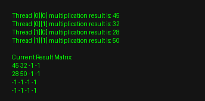

<a id="readme-top"></a>

<h1 align="center">Parallel Matrix Multiplication with Pthreads</h1>

<p align="center">
  Multithreaded matrix multiplication using C++ and pthreads with mutex-based synchronization.
</p>

<p align="center">
  
  
  
  
</p>
<br>

## Table of Contents

1. [Overview](#overview)  
2. [Key Features](#key-features)  
3. [Getting Started](#getting-started)  
4. [Usage](#usage)  
5. [Parallel Execution Output](#parallel-execution-output)  
6. [Technical Details](#technical-details)  
7. [Parallelization Strategy](#parallelization-strategy)  
8. [License](#license)

<br>

## Overview

This project implements parallel matrix multiplication using C++ and pthreads to improve computational efficiency.

The system distributes matrix row computations across multiple threads while ensuring safe execution through mutex-based synchronization.

The project demonstrates:

- Multithreaded computation using pthreads  
- Synchronization using mutex locks  
- Parallel processing of matrix operations  
- Efficient workload distribution across threads  

<br>
<p align="right">(<a href="#readme-top">back to top</a>)</p>
<br>

## Key Features

| Feature | Description |
|--------|------------|
| Multithreading | Parallel execution using pthreads |
| Mutex Synchronization | Safe access to shared resources |
| Work Distribution | Row-based parallel computation |
| Dynamic Task Allocation | Threads dynamically process matrix rows |
| Performance Optimization | Faster computation compared to sequential execution |

<br>
<p align="right">(<a href="#readme-top">back to top</a>)</p>
<br>

## Getting Started

### Prerequisites

- C++ compiler (g++)
- POSIX Threads (pthreads)

<br>

### Compile the code:

```bash
g++ parallel_computing.cpp -o parallel -pthread
```

### Run the program:

```bash
./parallel
```

<br>
<p align="right">(<a href="#readme-top">back to top</a>)</p>
<br>

## Usage

1. Compile the program using g++  
2. Run the executable  
3. Observe matrix initialization  
4. Track thread-based computations in output  
5. Analyze how threads update the result matrix  

<br>
<p align="right">(<a href="#readme-top">back to top</a>)</p>
<br>


## Parallel Execution Output

<p align="center">
  
</p>

<p align="center">
  Sample output demonstrating concurrent thread execution and synchronized updates to the result matrix.
</p>

<br>
<p align="right">(<a href="#readme-top">back to top</a>)</p>
<br>

## Technical Details

### Core Components

- pthread_create → thread creation  
- pthread_join → thread synchronization  
- pthread_mutex_lock/unlock → safe shared memory access  

<br>

### Implementation Highlights

- Shared counter (`step_i`) is used for dynamic row assignment  
- Mutex ensures threads do not conflict while updating results  
- Each thread computes a portion of the matrix multiplication  
- Results are stored in a shared matrix  

<br>
<p align="right">(<a href="#readme-top">back to top</a>)</p>
<br>

## Parallelization Strategy

The system follows a row-based parallelization approach:

1. Initialize matrices with random values  
2. Create multiple threads  
3. Assign rows dynamically using a shared counter  
4. Each thread computes one row of the result matrix  
5. Mutex ensures safe updates to shared memory  
6. Threads complete execution and join back  

This strategy ensures efficient utilization of threads while maintaining correctness.

<br>
<p align="right">(<a href="#readme-top">back to top</a>)</p>
<br>

## License

This project is licensed under the MIT License.  
See the [LICENSE](LICENSE) file for details.

<p align="right">(<a href="#readme-top">back to top</a>)</p>